# cadastro-jsf

<h1>Cadastro de pessoas com Maven, Java EE 8, JSF 2, PrimeFaces 6.2 , JPA e Hibernate 5, Wildfly 18 e banco de dados em memoria H2 1.4</h1>

<h1>No diretório raiz do projeto execute o mesmo pelo prompt de comando ou terminal usando o Maven.</h1>

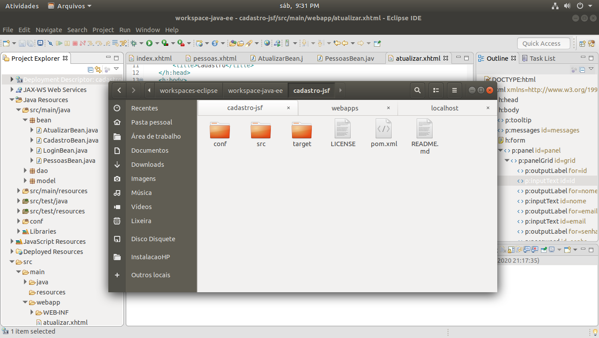

 

<h1>Use o plugin do Wildfly para fazer o deploy do projeto, no caso do Linux, clique com o botão direito do Mouse e escolha executar pelo terminal. Rode o comando: mvn wildfly:start</h1>

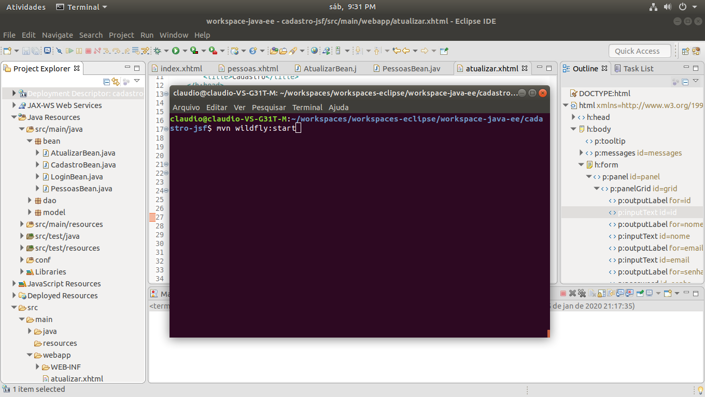

 

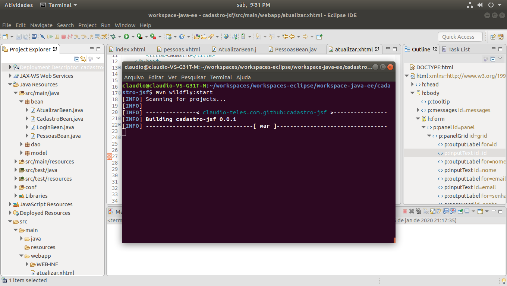

 

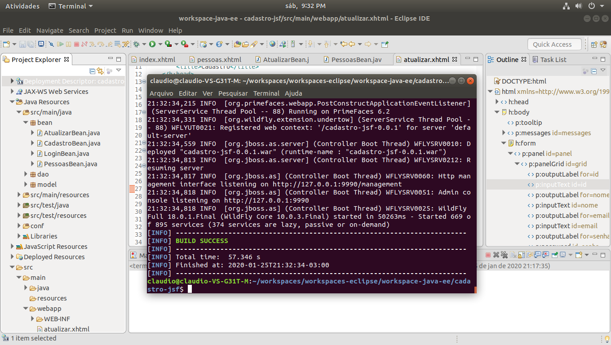

 

<h1>Execute em seguida o comando: mvn wildfly:deploy</h1>

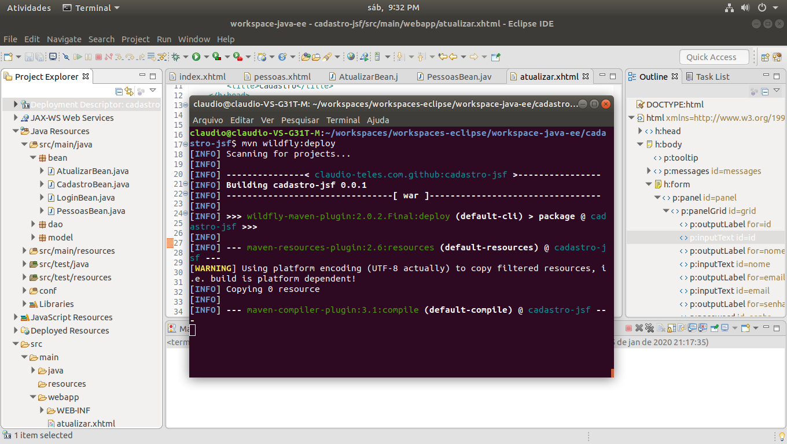

 

<h1>Para encerra a execução do plugin do Wildfly, execute: mvn wildfly:shutdown</h1>

 

<h1>Tela de Cadastro</h1>

 

<h1>TomCat Managed App</h1>

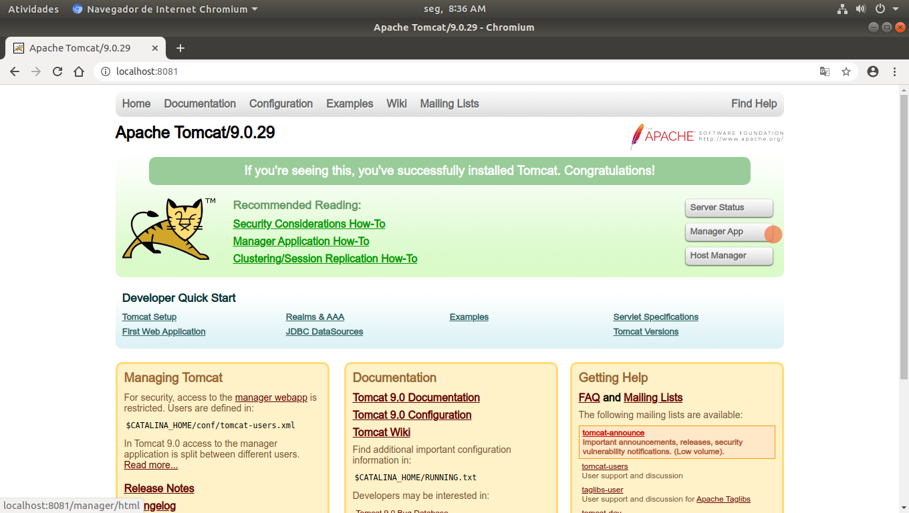

 

<h1>TomCat Procurar Executavel</h1>

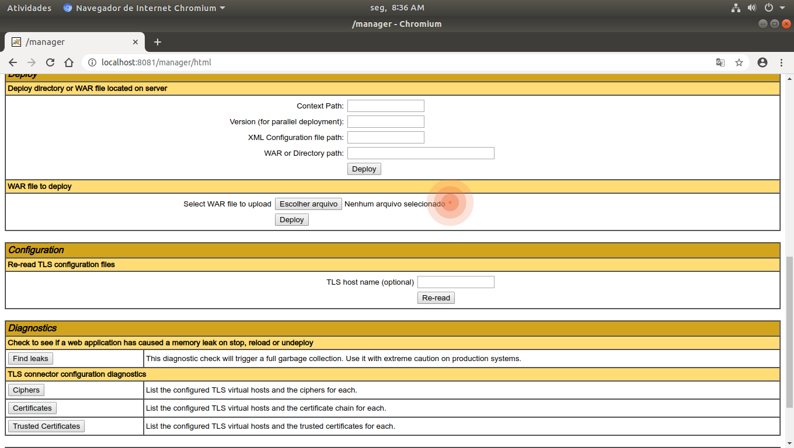

 

<h1>TomCat Fazer o Deploy</h1>

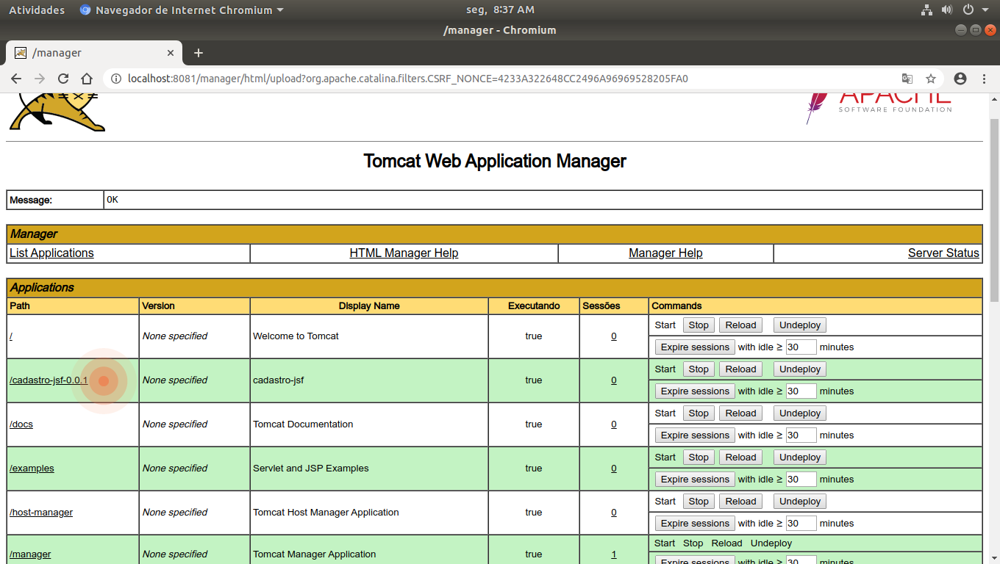

 

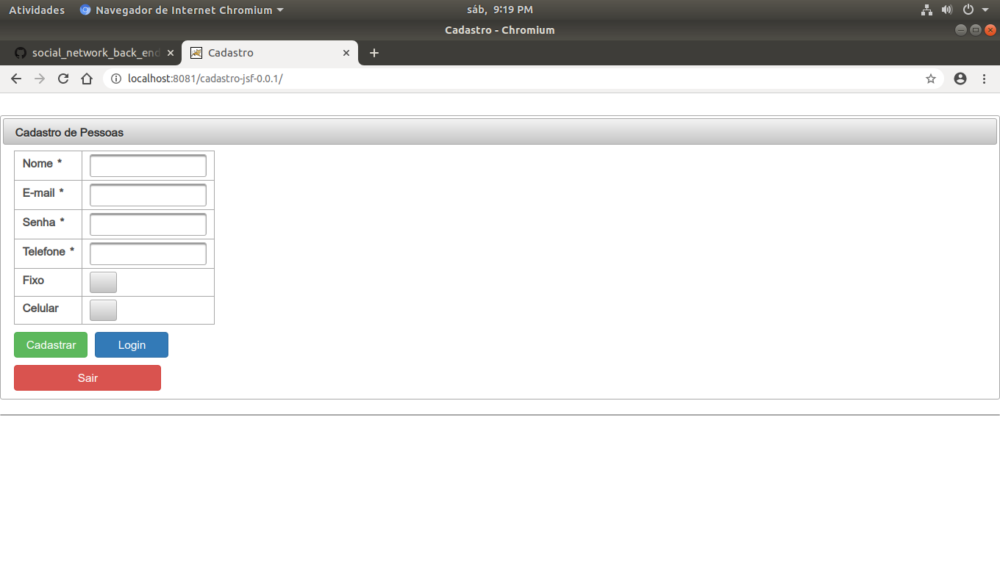

<h1>Lista de Pessoas cadastradas</h1>

 

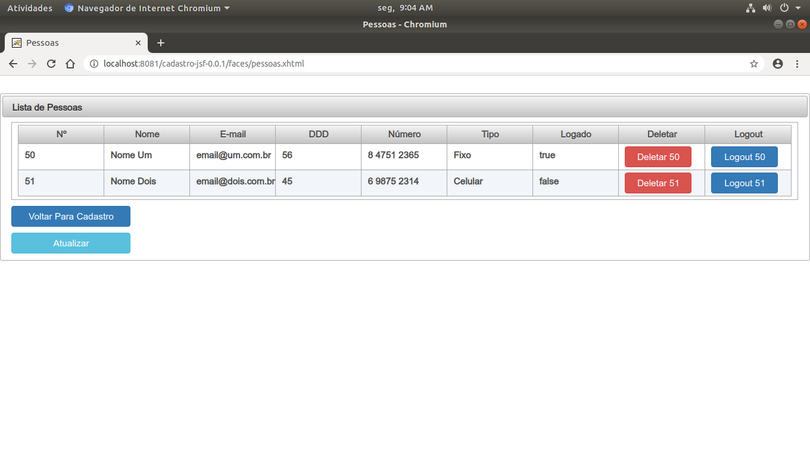

 

<h1>Diretório onde onde executavel: cadastro-jsf-001.war é salvo.</h1>

 

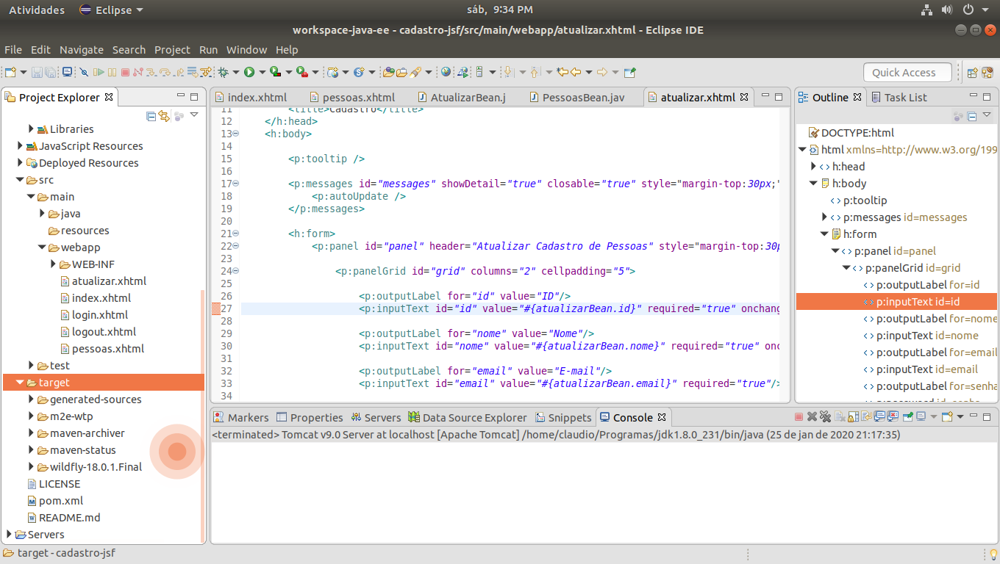

 

<h1>Executavel .war</h1>

 

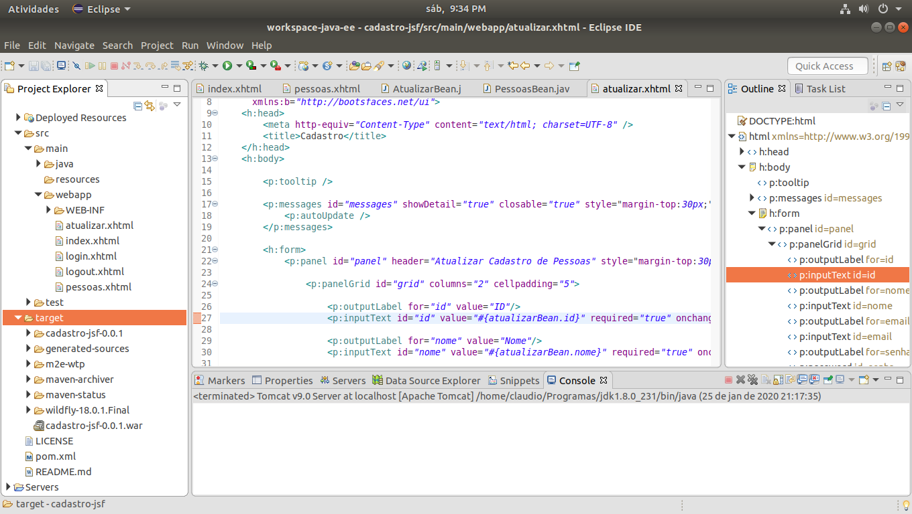

<h1>Atualizar Cadastro</h1>

 

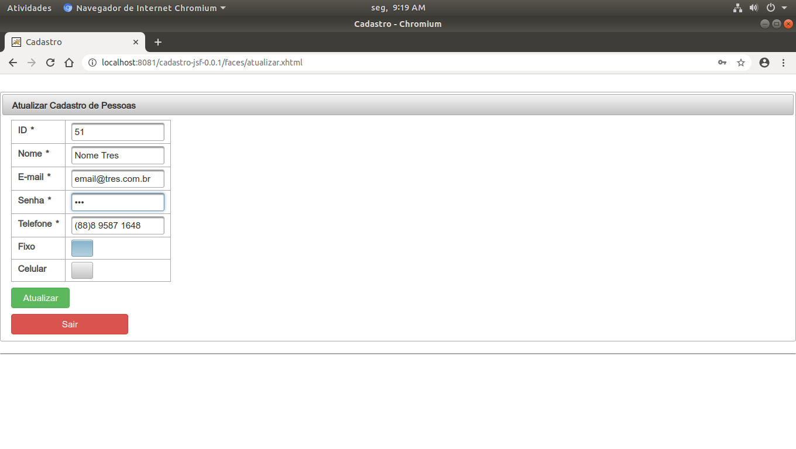

<h1>SQL da Tela de Atualizar Cadastro</h1>

 

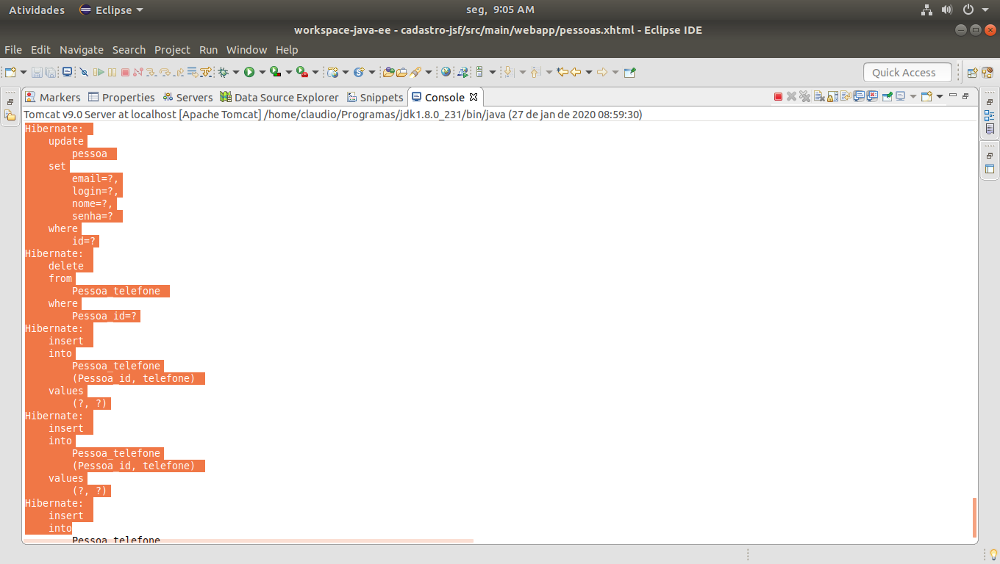

